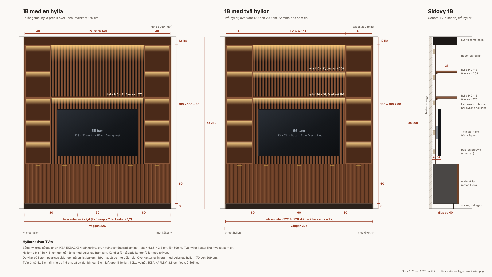
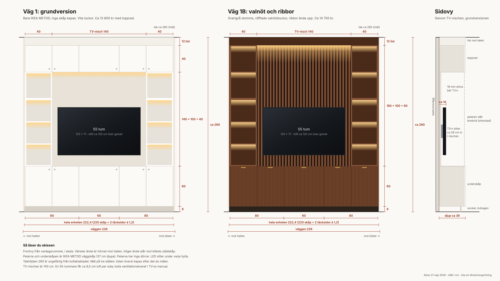

# TV-väggen i vardagsrummet

Plan för TV-väggen mot badrumsväggen i vardagsrummet: 226 cm bred, från golv till tak.

**Vald version: valnöt och ribbor, med en hylla över TV:n.** Den byggs av IKEA:s köksskåp i
svartgrått. Luckorna blir räfflade i valnöt, som skrivbordet. Bakom TV:n sitter valnötsribbor
med svarta springor ända upp, och ovanför TV:n en lång hylla.

Priserna ligger också i möbelkalkylen under Vardagsrum, på raderna som börjar med "TV-vägg".
Uppdaterad 28 september 2026.

## Så ser den ut

Den vänstra skissen är den valda, med en hylla över TV:n. Den högra visar hur det blir med två.
Bänkskivan som hyllan sågas ur räcker till två, så en andra hylla kan sättas upp senare.

Första skissen, med en vit grundversion bredvid valnötsversionen:

## Mått

- Bredd 222 cm, så det blir knappt 2 cm luft mot väggens ändar. Djup ca 40 cm. Höjd upp till
  taket, ca 260 cm.
- Underskåp 60 cm höga på en 8 cm sockel. En 40 cm bred hyllpelare på var sida.
  TV-nischen emellan är 140 cm bred.
- TV:n är 55 tum, med mitten ca 115 cm över golvet. Hyllan över den har överkant 170 cm, i
  linje med pelarnas hyllor.

## Inköpslista, ca 14 700 kr

| Butik | Vad | Pris |
|---|---|---:|
| IKEA | METOD väggskåp i svartgrått: underskåp 80 + 60 + 80 cm, pelare 40 × 100 och 40 × 80 på var sida. VALLSTENA-dörrar, gångjärn, hyllplan i pelarna, ben, sockel, skenor, skruv | 6 640 |
| IKEA | SINARP täcksida brun, 39 × 240 cm, 2 st till ändarna | 1 678 |
| IKEA | EKBACKEN bänkskiva brun valnötsmönstrad, sågas till hyllan över TV:n | 699 |
| IKEA | ORMANÄS LED-list 4 m, 2 st, plus fjärrkontroll och batterier | 946 |
| Bauhaus | Akustikpanel FibroTech Quanti valnöt, 3 st, till ribborna bakom TV:n | 1 497 |
| Indoor Wood | Räfflad panel valnöt oljad, 60 × 270 cm, till räfflingen på luckorna | 899 |
| Flera | Lim, självhäftande valnötsfolie, TV-fäste, reglar, list mot taket, förankring | ca 2 050 |
| Badshop | Mässingshandtag Beslag Design Side 40, 5 st | 290 |
| | **Totalt** | **ca 14 700** |

Två saker kan vänta. De ligger som "idé" i kalkylen och räknas inte mot budgeten: hyllplan inne
i underskåpen (448 kr) och en tredje LED-list under hyllan (399 kr). Med dem blir det ca
15 550 kr. Frakt ingår inte.

**Produktsidor**

- METOD väggskåp svartgrå: https://www.ikea.com/se/sv/p/metod-vaeggskap-svartgra-10591714/
- SINARP täcksida: https://www.ikea.com/se/sv/p/sinarp-taecksida-brun-20404142/
- EKBACKEN bänkskiva: https://www.ikea.com/se/sv/p/ekbacken-baenkskiva-brun-valnoetsmoenstrad-laminat-90442980/
- ORMANÄS LED-list: https://www.ikea.com/se/sv/p/ormanaes-led-ljuslist-smart-tradloes-dimbar-faergat-och-vitt-spektrum-40497395/
- FibroTech Quanti valnöt: https://www.bauhaus.se/akustikpanel-fibrotech-quanti-valnot-18x520x2440mm
- Räfflad panel valnöt: https://indoorwood.se/products/designpanel-fingerpanel-valnot
- Mässingshandtag: https://www.badshop.se/interior/inredning-och-belysning/beslag/handtag/profilhandtag-beslag-design-side-40-mm/p-1801128-1801130

Priserna är från 27–28 september. Den räfflade panelen är på rea, ordinarie pris 1 195 kr.
ORMANÄS ska sluta säljas snart, så den behöver köpas i tid.

## Innan vi köper

- Mät takhöjden på tre ställen längs väggen. Listen mot taket kapas efter det.
- Ta reda på om väggen är förstärkt för en TV. Ritningen nämner en förstärkt vägg men inte
  vilken. Hyresvärden bör veta.
- Kolla var eluttag och antennuttag sitter på väggen, så skåpen får urtag där.
- Kolla TV:ns vikt, fästmått (VESA) och hur mycket luft den behöver runt sig.

## Bygget i korthet

1. Sockel och underskåp, hopskruvade.
2. Pelarna ovanpå, förankrade mot tippning. Väggen bär ingen vikt, den håller bara emot.
3. Reglar mellan pelarna. Ribbpanelerna och TV-fästet skruvas i reglarna.
4. Hyllan vilar på lister i pelarna och längs bakkanten.
5. Täcksidor, list mot taket och LED.
6. Luckorna sist. Gör en provdörr med räfflingen först och kolla att den inte tar i grannen när
   den öppnas.
