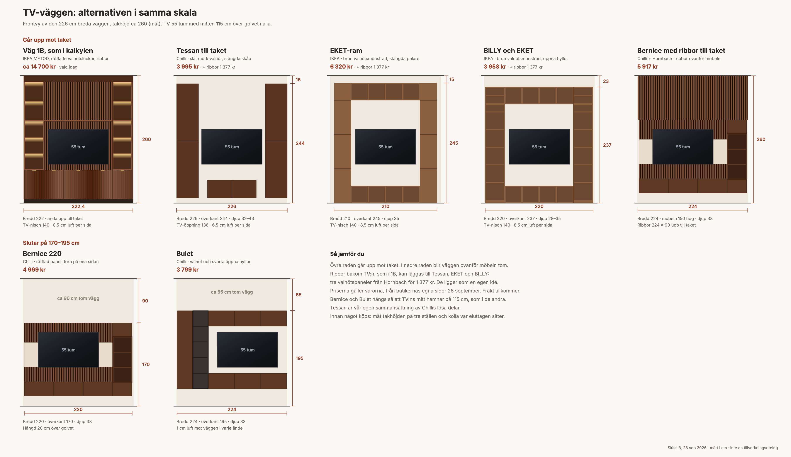

# TV-väggen: billigare alternativ

Väg 1B, som ligger vald i kalkylen, kostar ca 14 700 kr. Här är sex billigare sätt att göra
TV-väggen, ritade i samma skala på den 226 cm breda väggen. Fyra går upp mot taket och två slutar
på 170–195 cm.

Alla ligger som idéer under Vardagsrum i Vårt hem, så att priserna kan jämföras. De räknas inte
mot budgeten förrän någon väljer dem. Priserna gäller varorna och är från butikernas egna sidor
28 september 2026. Frakt tillkommer.

## Går upp mot taket

### Tessan till taket, 3 995 kr (Chilli)

- Stängda skåp i slät mörk valnöt på båda sidor och en bänk emellan. Inga handtag.
- Chilli säljer inte den här kombinationen färdig. Den är satt ihop av Chillis lösa delar.
- [Tessan väggskåp 45 cm brun](https://www.chilli.se/f%C3%B6rvaring/badrumsf%C3%B6rvaring/spegelsk%C3%A5p/tessan-v%C3%A4ggsk%C3%A5p-45-cm-brun-p3434100),
  45 × 117 × 32 cm, 4 st à 799 kr. Två staplade på varje sida.
- [Tessan TV-bänk 100 cm brun](https://www.chilli.se/m%C3%B6bler/mediam%C3%B6bler/tv-b%C3%A4nk-mediab%C3%A4nk/tessan-tv-b%C3%A4nk-100-cm-brun-p3434082),
  100 × 37 × 43 cm, 799 kr.
- 226 cm bred med skåpen mot väggarna. Hängs skåpen 10 cm över golvet blir överkanten ca 244 cm.
- Öppningen för TV:n blir 136 cm, så TV:n får 6,5 cm luft per sida. Det är knappt.
- Bänken är 11 cm djupare än skåpen och har 2,7 av 5 i betyg (3 omdömen).

### EKET-ram, 6 320 kr (IKEA)

- Stängda pelare, bänk och brygga i samma brun valnötsmönstrade, som LACK-hyllorna.
- [EKET väggskåp med hyllplan och dörr](https://www.ikea.com/se/sv/p/eket-vaeggsk-m-1-hyllpl-dr-brun-valnoetsmoenstrad-s39590380/),
  35 × 35 × 70 cm, 6 st à 545 kr. Tre i varje pelare.
- [EKET väggskåp med dörr](https://www.ikea.com/se/sv/p/eket-vaeggskap-m-1-doerr-brun-valnoetsmoenstrad-s09581179/),
  35 × 35 × 35 cm, 2 st à 345 kr. Överst på pelarna.
- [EKET förvaringskombination](https://www.ikea.com/se/sv/p/eket-vaeggmonterad-foervaringskombination-brun-valnoetsmoenstrad-s49567497/),
  140 × 35 × 35 cm med fyra öppna fack, 2 st à 1 180 kr. En som bänk och en som brygga.
- 210 cm bred, så det blir 8 cm vägg i varje ände. Överkant 245 cm.
- TV-nischen blir 140 × 175 cm, så TV:n får 8,5 cm luft per sida.
- IKEA kräver minst 5 cm mellan skåpens ovansida och taket.
- Det är många moduler som ska hängas exakt i våg.

### BILLY och EKET, 3 958 kr (IKEA)

- Två höga bokhyllor med en bänk och en brygga emellan, i brun valnötsmönstrad.
- [BILLY bokhylla med förhöjningsdel](https://www.ikea.com/se/sv/p/billy-bokhylla-med-foerhoejningsdel-brun-valnoetsmoenstrad-s09581891/),
  40 × 28 × 237 cm, 2 st à 799 kr.
- [EKET förvaringskombination](https://www.ikea.com/se/sv/p/eket-vaeggmonterad-foervaringskombination-brun-valnoetsmoenstrad-s49567497/),
  140 × 35 × 35 cm, 2 st à 1 180 kr.
- 220 cm bred, 3 cm luft i varje ände. Överkant 237 cm.
- TV-nischen blir 140 × 167 cm, 8,5 cm luft per sida.
- Hyllorna är öppna. BILLY är 28 cm djup och EKET 35, så fronterna ligger inte i linje.

### Bernice med ribbor till taket, 5 917 kr (Chilli och Hornbach)

- Bernice 220 (se nedan) med valnötsribbor på väggen ovanför, ända upp till taket.
- [Bernice TV-skåp 220 cm brun](https://www.chilli.se/m%C3%B6bler/mediam%C3%B6bler/tv-mobelset/bernice-tv-sk%C3%A5p-220-cm-brun-p3447247), 4 999 kr.
- [Akustikpanel valnöt](https://www.hornbach.se/p/akustikpanel-valnot-18x560x2600mm/12085623/),
  56 × 260 cm, 2 st à 459 kr. Kapas till fyra bitar på 56 × 90 cm, som täcker 224 cm.
- Möbeln och panelerna kommer från olika tillverkare, så valnöten kan ha olika ton.
- Upptill blir det ingen förvaring.

## Slutar lägre

### Bernice 220, 4 999 kr (Chilli)

- [Bernice TV-skåp 220 cm brun](https://www.chilli.se/m%C3%B6bler/mediam%C3%B6bler/tv-mobelset/bernice-tv-sk%C3%A5p-220-cm-brun-p3447247)
  (DEROMI II), 220 × 150 × 38 cm. Ordinarie pris 6 999 kr.
- Räfflad valnötspanel bakom TV:n, ljusa band på sidorna, en bänk och ett torn med öppna hyllor
  på ena sidan.
- Samma möbel med stängt torn heter
  [DEROMI VI](https://www.chilli.se/m%C3%B6bler/mediam%C3%B6bler/tv-mobelset/bernice-tv-sk%C3%A5p-220-cm-brun-p3447308)
  och kostar samma.
- Hängd 20 cm över golvet slutar den på 170 cm. Ca 90 cm vägg blir tom upp till taket.
- Nyhet, inga omdömen än.

### Bulet, 3 799 kr (Chilli)

- [Bulet TV-skåp brun](https://www.chilli.se/m%C3%B6bler/mediam%C3%B6bler/tv-mobelset/bulet-tv-sk%C3%A5p-brun-p3447181),
  224 × 160 × 33 cm. Ordinarie pris 4 999 kr.
- Valnöt med två pelare på ena sidan, en stängd och en med svarta öppna hyllor. Överskåp och
  bänk ramar in TV:n.
- Hängd så att TV:ns mitt hamnar på 115 cm slutar den på ca 195 cm. Ca 65 cm vägg blir tom.
- Bara 1 cm luft mot väggen i varje ände. Är väggarna inte helt raka går den inte in.
- Nyhet, inga omdömen än.

## Tillval: ribbor bakom TV:n, 1 377 kr

- Valnötsribbor i TV-nischen, som i 1B. Går att lägga till Tessan, EKET och BILLY.
- [Akustikpanel valnöt](https://www.hornbach.se/p/akustikpanel-valnot-18x560x2600mm/12085623/),
  56 × 260 × 1,8 cm, MDF med äkta träfanér i valnötsfärg. 3 st à 459 kr, kapas till nischens
  bredd.
- Ligger som en egen idé i Vårt hem, så att den kan väljas till vilket alternativ som helst.

## Innan något köps

- Mät takhöjden på tre ställen längs väggen.
- Kolla var eluttag och antennuttag sitter på väggen.
- Vi får borra i väggen, men rören på badrumssidan finns kvar. Använd en detektor som hittar plaströr.
- Kolla frakten i varje butiks kassa.

Skissen är i skala men är ingen tillverkningsritning. Uppdaterad 28 september 2026.
